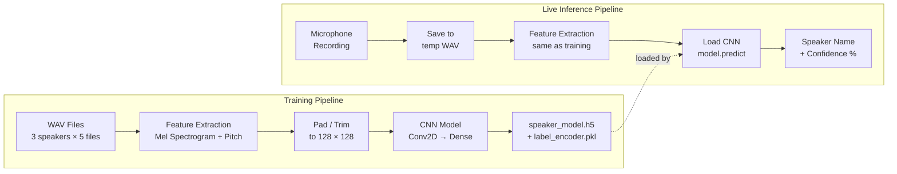
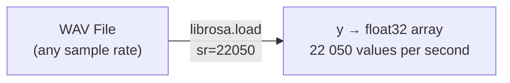
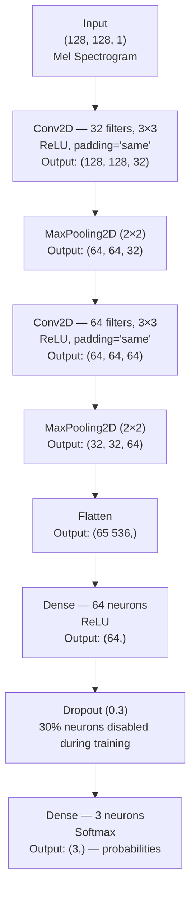
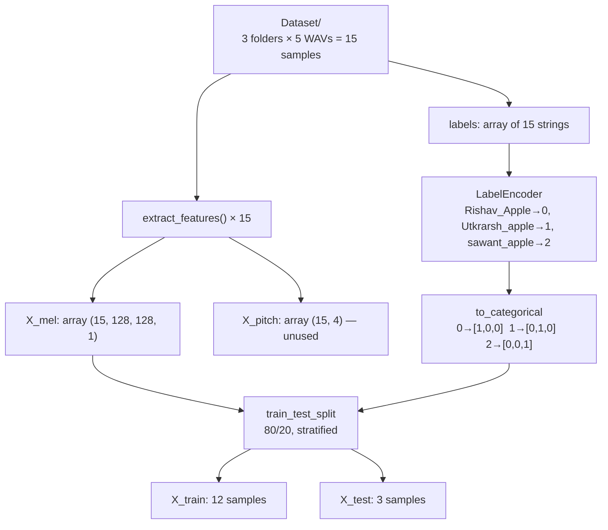
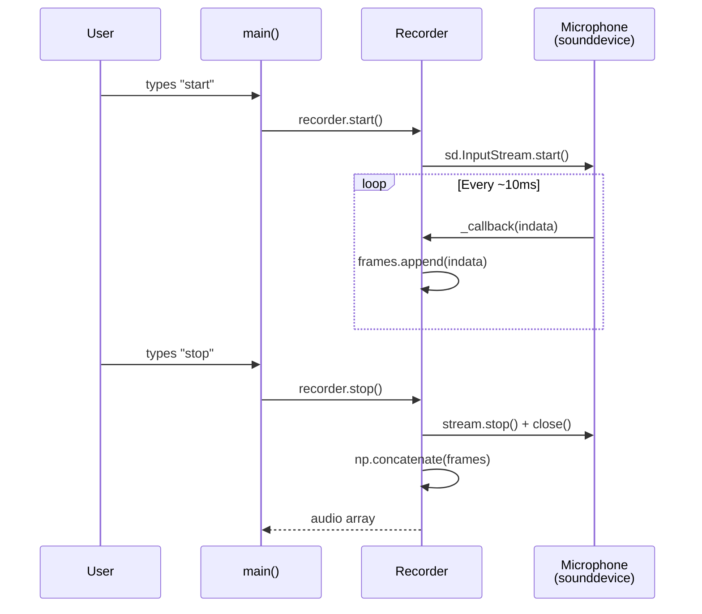

# 🔬 Speaker Recognition System — Deep Dive

> A comprehensive technical explanation of the entire pipeline: training, inference,
> every parameter choice, and the math behind it.

---

## 📐 System Architecture Overview



---

## 1 — Feature Extraction (The Foundation)

Both `train_model.py` and `live_recognition.py` convert raw audio into a Mel spectrogram.
The steps are identical so the model always sees data in the same format.

### 1.1  Loading the Audio

```python
y, sr = librosa.load(file_path, sr=SAMPLE_RATE)   # SAMPLE_RATE = 22050
```

| Symbol | Meaning |
|--------|---------|
| `y` | 1-D NumPy array of amplitude values (the waveform) |
| `sr` | Sample rate — how many samples per second |



### 1.2  Computing the Mel Spectrogram

```python
mel = librosa.feature.melspectrogram(y=y, sr=sr, n_mels=N_MELS)
mel_db = librosa.power_to_db(mel, ref=np.max)
```

**What happens internally:**

1. The signal `y` is split into overlapping short windows (frames).
2. For each frame, a **Short-Time Fourier Transform (STFT)** extracts the frequency content.
3. The frequency axis is warped onto the **Mel scale** — a perceptual scale where equal
   distances correspond to equal perceived pitch differences.
4. The result is a 2-D matrix: **rows = Mel bands**, **columns = time frames**.
5. `power_to_db` converts raw power values to **decibels (dB)**: `10 · log₁₀(power / ref)`.

```
                    ┌────────────────────────────────────────┐
   Mel band 128 →   │▓▓░░░░▓▓▓▓░░░░░░▓▓▓▓▓▓░░░░░░░░▓▓▓▓▓▓│
                    │░░▓▓░░░░▓▓░░░░▓▓░░░░▓▓░░░░▓▓░░░░░░▓▓│
                    │▓▓▓▓▓▓░░░░░░▓▓▓▓▓▓░░░░░░▓▓▓▓▓▓░░░░░░│
                    │░░░░▓▓▓▓▓▓░░░░░░▓▓▓▓▓▓░░░░░░▓▓▓▓▓▓░░│
   Mel band 1   →   │▓▓▓▓▓▓▓▓▓▓▓▓▓▓▓▓▓▓▓▓▓▓▓▓▓▓▓▓▓▓▓▓▓▓▓▓│
                    └────────────────────────────────────────┘
                     time frame 1                   time frame N
                             ▓ = louder   ░ = quieter
```

### 1.3  Padding / Trimming

```python
if mel_db.shape[1] < FIXED_WIDTH:          # shorter than 128 frames
    pad_width = FIXED_WIDTH - mel_db.shape[1]
    mel_db = np.pad(mel_db, ((0,0),(0,pad_width)), mode='constant')
else:                                       # longer than 128 frames
    mel_db = mel_db[:, :FIXED_WIDTH]
```

```
Before (short clip):  128 × 90   → pad 38 columns of zeros → 128 × 128
Before (long clip):   128 × 200  → trim to first 128 cols  → 128 × 128
```

**Why?** CNNs require fixed-size inputs. Every spectrogram enters the network as
exactly **(128, 128, 1)** — 128 Mel bands × 128 time frames × 1 channel (grayscale).

### 1.4  Pitch Extraction (train_model.py only)

```python
f0 = librosa.yin(y, fmin=50, fmax=500, sr=sr)
f0 = f0[f0 > 0]                               # keep voiced frames only
pitch_feats = [mean(f0), std(f0), min(f0), max(f0)]
```

> [!NOTE]
> Pitch features are **extracted but not actually used** in the current CNN training.
> Only `X_mel` is fed into `model.fit()`. The pitch features were planned as a
> secondary input for a future multi-input model but are unused in this version.

---

## 2 — The CNN Architecture

Defined in `build_cnn()` inside `train_model.py`.

### 2.1  Layer-by-Layer Walkthrough



### 2.2  What Each Layer Does

| # | Layer | Purpose | Output Shape |
|---|-------|---------|-------------|
| 1 | `Conv2D(32, 3×3)` | Learns 32 small pattern detectors (edges, textures in the spectrogram). Each filter slides across the image and produces a "feature map" highlighting where that pattern appears. | (128, 128, 32) |
| 2 | `MaxPooling2D(2×2)` | Halves each spatial dimension by keeping only the max value in each 2×2 patch. Reduces computation and makes the network somewhat translation-invariant. | (64, 64, 32) |
| 3 | `Conv2D(64, 3×3)` | Learns 64 higher-level patterns by combining the simpler patterns from layer 1. | (64, 64, 64) |
| 4 | `MaxPooling2D(2×2)` | Halves spatial dimensions again. | (32, 32, 64) |
| 5 | `Flatten` | Reshapes the 3-D feature maps into a single 1-D vector: 32 × 32 × 64 = **65,536** values. | (65536,) |
| 6 | `Dense(64, relu)` | Fully-connected layer that learns non-linear combinations of all features. | (64,) |
| 7 | `Dropout(0.3)` | Randomly zeroes 30% of outputs during training, forcing the network to not rely on any single neuron. Prevents overfitting. | (64,) |
| 8 | `Dense(3, softmax)` | Final classification layer — one neuron per speaker. Softmax ensures outputs sum to 1.0, interpretable as probabilities. | (3,) |

### 2.3  Activation Functions Explained

```
ReLU:     f(x) = max(0, x)

          output
            │     /
            │    /
            │   /
          0 │──/──────── x
            │
            │

Softmax:  σ(zᵢ) = eᶻⁱ / Σⱼ eᶻʲ

  Raw scores:    [2.0, 1.0, 0.5]
       ↓ softmax
  Probabilities: [0.59, 0.24, 0.17]  (sum = 1.0)
```

- **ReLU** adds non-linearity while being computationally cheap. It kills negative values
  (which don't carry useful information in our feature maps).
- **Softmax** converts arbitrary real numbers into a probability distribution over the
  3 speakers.

---

## 3 — Training Process

### 3.1  Data Preparation



### 3.2  What Happens During `model.fit()`

Each **epoch** (one full pass through training data) works like this:

```
For each batch of 4 samples:
   1. FORWARD PASS  — push spectrograms through the CNN → get predictions
   2. LOSS          — compare predictions to true labels using categorical crossentropy
   3. BACKWARD PASS — compute gradients (how much each weight contributed to the error)
   4. UPDATE        — Adam optimizer adjusts weights to reduce the loss
```

```
                     Epoch 1                    Epoch 30
Loss:               ████████████████  (high)    ██  (low)
Accuracy:           ██  (low)                   ████████████████  (high)

The model gradually learns to map spectrograms → correct speaker labels
```

### 3.3  Loss Function — Categorical Crossentropy

```
Loss = -Σᵢ yᵢ · log(ŷᵢ)

Where:
  yᵢ = true label  (one-hot, e.g. [1, 0, 0])
  ŷᵢ = predicted   (e.g.     [0.8, 0.1, 0.1])

Example:
  Loss = -(1·log(0.8) + 0·log(0.1) + 0·log(0.1))
       = -log(0.8)
       = 0.223

Perfect prediction [1.0, 0, 0] → Loss = 0
Worst prediction   [0, 0.5, 0.5] → Loss = very high
```

This loss penalises wrong predictions heavily and rewards confident correct ones.

### 3.4  Optimizer — Adam

Adam (**Ada**ptive **M**oment Estimation) auto-tunes the learning rate for each parameter:

- Tracks the **running average** of gradients (momentum) → smoother updates
- Tracks the **running average of squared gradients** → adapts step size per-parameter
- Default learning rate: `0.001`

Why Adam? It converges faster than basic SGD and requires almost no tuning — ideal for
small datasets like ours.

---

## 4 — Every Parameter Explained

### 4.1  Audio & Feature Parameters

| Parameter | Value | Why This Value |
|-----------|-------|----------------|
| `SAMPLE_RATE` | **22050 Hz** | Industry standard for speech/music analysis. Human voice ranges up to ~8 kHz; by Nyquist theorem, 22050 Hz can capture frequencies up to 11025 Hz — more than sufficient. Higher rates (44100) would double memory/compute with negligible benefit for speech. |
| `N_MELS` | **128** | Number of Mel filter banks (rows in the spectrogram). 128 is the LibROSA default and provides good frequency resolution. Values of 40–80 are used for lightweight tasks; 128 gives richer detail for distinguishing speakers. |
| `FIXED_WIDTH` | **128** | Fixed number of time frames (columns). Combined with N_MELS=128, this creates a square 128×128 "image" — a natural shape for CNNs. At the default hop length of 512 and sample rate of 22050, 128 frames ≈ 3 seconds of audio. |
| `HOP_LENGTH` | **512** | (in `generate_spectrograms.py`) Samples between successive STFT frames. Smaller = more overlap = finer time resolution but more columns. 512 is the LibROSA default, giving ~43 frames per second at 22050 Hz. |
| `fmin` / `fmax` | **50 / 500** Hz | Range for pitch (F0) detection via YIN algorithm. Human fundamental frequency: ~85–255 Hz for adults. The range [50, 500] safely covers all adult voices including edge cases (very deep bass or high-pitched children's voices). |

### 4.2  Training Hyperparameters

| Parameter | Value | Why This Value |
|-----------|-------|----------------|
| `EPOCHS` | **30** | Number of full passes through the training data. With only 12 training samples and a simple 2-block CNN, 30 epochs is enough for convergence without severe overfitting. More epochs risk memorising the tiny dataset. |
| `BATCH_SIZE` | **4** | Samples processed before each weight update. With only 12 training samples, batch size 4 means 3 gradient updates per epoch. Very small batches introduce noise that acts as regularisation — helpful for tiny datasets. |
| `test_size` | **0.2** | 20% of data reserved for testing (3 samples). With 15 total samples, this means 1 test sample per speaker when `stratify` is enabled. |
| `random_state` | **42** | Seed for reproducibility. Any integer works; 42 is a convention (Hitchhiker's Guide!). Ensures the same train/test split every run. |
| `stratify` | **y_encoded** | Ensures proportional speaker representation in both train and test sets. Without this, the random split could put all samples of one speaker in training and none in test. |

### 4.3  CNN Architecture Parameters

| Parameter | Value | Why This Value |
|-----------|-------|----------------|
| **Filters (Block 1)** | 32 | A modest number for the first layer — learns basic patterns (frequency edges, energy blobs). Starting small keeps computation manageable. |
| **Filters (Block 2)** | 64 | Doubles the filters to learn more complex/combined patterns at reduced spatial resolution. Standard practice: double filters as spatial size halves. |
| **Kernel Size** | (3, 3) | The "receptive field" of each filter. 3×3 is the most common choice — small enough to detect fine-grained patterns, large enough to see meaningful structure. Proven effective across image and spectrogram tasks. |
| **Padding** | `'same'` | Adds zero-padding so the output has the same spatial dimensions as the input. Without this, each conv layer would shrink the spatial size by (kernel−1) pixels. |
| **Pooling Size** | (2, 2) | Halves each spatial dimension. Standard choice for progressive downsampling. |
| **Dense Neurons** | 64 | Compresses the 65,536-dim flattened vector into 64 features. Small enough to prevent overfitting on 12 training samples, large enough to encode meaningful patterns. |
| **Dropout Rate** | 0.3 | 30% of neurons are disabled per training step. This is in the typical range (0.2–0.5). Higher values would be too aggressive for our small network; lower values would provide less regularisation. |
| **Output Activation** | `softmax` | Produces a proper probability distribution over the 3 classes. Required for categorical crossentropy loss. |
| **Optimizer** | `adam` | Auto-adapting learning rate. Best default choice for most problems. |
| **Loss** | `categorical_crossentropy` | Standard loss for multi-class classification with one-hot labels. Measures the "distance" between predicted and true probability distributions. |

### 4.4  Live Recognition Parameters

| Parameter | Value | Why This Value |
|-----------|-------|----------------|
| `channels` | **1** | Mono recording — speech recognition doesn't benefit from stereo. |
| `dtype` | `float32` | 32-bit floating point for maximum precision during processing. |
| **32767 scaling** | `audio * 32767` | Converts float32 range [-1, +1] to int16 range [-32768, +32767] for WAV file format. |

---

## 5 — Data Flow: Dimension Tracking

This tracks the exact shape of data through every operation:

```
 Raw WAV file
     │
     ▼
 librosa.load() → y: (N_samples,)     e.g. (66150,) for 3 seconds
     │
     ▼
 melspectrogram() → mel: (128, T)      T depends on audio length
     │
     ▼
 power_to_db()  → mel_db: (128, T)    same shape, values in dB
     │
     ▼
 pad/trim       → mel_db: (128, 128)  fixed size
     │
     ▼
 newaxis        → mel_db: (128, 128, 1)   add channel dim
     │
     ▼
 ─── CNN ────────────────────────────────────
     │
 Conv2D(32)     → (128, 128, 32)      32 feature maps
 MaxPool(2,2)   → (64, 64, 32)        halved
 Conv2D(64)     → (64, 64, 64)        64 feature maps
 MaxPool(2,2)   → (32, 32, 64)        halved again
 Flatten        → (65536,)            32×32×64
 Dense(64)      → (64,)               compressed
 Dropout(0.3)   → (64,)               same shape, some zeros
 Dense(3)       → (3,)                one prob per speaker
     │
     ▼
 argmax → class index → label_encoder → "Speaker Name"
```

---

## 6 — Live Recognition Pipeline

### 6.1  Recording Mechanism



The `Recorder` class uses **sounddevice**'s callback-based API. The microphone runs on a
separate thread — while the main thread waits for user input, `_callback()` is called
automatically every time a new audio chunk arrives (~every 10 ms) and appends it to
`self.frames`.

### 6.2  Prediction Step

```python
mel = extract_features(file_path)             # (128, 128, 1)
mel_input = np.expand_dims(mel, axis=0)       # (1, 128, 128, 1) — batch of 1
predictions = model.predict(mel_input)         # [[0.80, 0.15, 0.05]]
predicted_class = np.argmax(predictions)       # 0
speaker_name = label_encoder.inverse_transform([0])  # "Rishav_Apple"
confidence = 0.80 * 100                              # 80.0%
```

The model outputs a probability distribution. `argmax` picks the most confident class.

---

## 7 — How a CNN "Sees" a Spectrogram

A Mel spectrogram is treated like a grayscale image:

- **Rows** = frequency bands (low → high)
- **Columns** = time frames (left → right)
- **Pixel intensity** = energy in dB (brighter = louder)

```
  High freq │░░░░░░░░░░░░░░░░░░░░░░░░│  ← quiet at high frequencies
            │░░░░▓▓░░░░░░▓▓▓░░░░░░░░░│  ← some harmonics
            │░░▓▓▓▓▓░░░▓▓▓▓▓▓░░░░░░░░│  ← stronger harmonics
            │▓▓▓▓▓▓▓▓▓▓▓▓▓▓▓▓▓▓▓▓░░░░│  ← fundamental frequency region
  Low freq  │▓▓▓▓▓▓▓▓▓▓▓▓▓▓▓▓▓▓▓▓▓▓▓▓│  ← lots of energy
            └────────────────────────┘
             Start                 End
                     Time →

Different speakers have:
  • Different fundamental frequencies (row position of strongest bands)
  • Different harmonic patterns (spacing between bright rows)
  • Different formant shapes (which frequency regions are emphasised)
  • Different temporal patterns (speaking rhythm)
```

**Conv2D filters learn to detect these differences automatically.**
Block 1 filters detect simple edges and energy patches; Block 2 filters combine them into
speaker-specific patterns.

---

## 8 — Evaluation Metrics

### 8.1  Accuracy

```python
loss, acc = model.evaluate(X_mel_test, y_test, verbose=0)
```

**Accuracy** = (correctly classified samples) / (total samples) × 100

With 3 test samples (one per speaker), each correct prediction adds ~33.3%.

### 8.2  Categorical Crossentropy Loss

During training, the loss curve shows how well the model is learning:

```
Loss
  │
3 │██
  │
2 │  ████
  │
1 │      ████████
  │
0 │              ████████████████
  └──────────────────────────────
   0     5    10    15    20   30   Epoch
```

- **High loss** → model is making poor predictions
- **Low loss** → model predictions closely match true labels
- If loss goes down then back up → **overfitting** (model memorised training data)

### 8.3  Training vs Validation Accuracy

```
Accuracy
   │
100│              ████████████████  ← training acc (usually hits 100%)
   │
 80│          ████████████████████  ← validation acc
   │
 60│      ████
   │
 40│  ████
   │
 20│██
   │
   └──────────────────────────────
    0     5    10    15    20   30   Epoch
```

- **Training accuracy** can reach 100% because the model sees these samples repeatedly.
- **Validation accuracy** is the real measure — how well the model generalises.
- A big gap between them signals overfitting (Dropout helps reduce this).

### 8.4  Confidence Score

```python
confidence = predictions[0][predicted_class] * 100
```

This is the softmax probability of the top class, expressed as a percentage.

| Confidence | Interpretation |
|------------|---------------|
| 90–100% | Very confident — strong match to the speaker |
| 70–89% | Reasonably confident — likely correct |
| 50–69% | Uncertain — might be wrong |
| < 50% | Low confidence — the model is guessing |

---

## 9 — Spectrogram Generation (`generate_spectrograms.py`)

This utility script creates visual PNG images of spectrograms for inspection.


### 9.1  Visual Parameters

| Parameter | Value | Purpose |
|-----------|-------|---------|
| `FIG_SIZE` | (6, 4) inches | Width × height of the saved image |
| `DPI` | 100 | Resolution — 100 DPI × (6, 4) = 600 × 400 pixels |
| `cmap` | `'magma'` | Colour palette — dark-to-bright, good for spectrograms |
| `x_axis` | `'time'` | Label x-axis in seconds |
| `y_axis` | `'mel'` | Label y-axis in Hz on Mel scale |

---

## 10 — Key Concepts Glossary

| Term | Explanation |
|------|-------------|
| **Mel Scale** | A perceptual frequency scale where equal distances sound equally far apart to humans. Based on psychoacoustic research — we hear the difference between 200 Hz and 400 Hz as the "same distance" as 2000 Hz and 4000 Hz. |
| **STFT** | Short-Time Fourier Transform — breaks audio into overlapping frames and computes frequency content of each. The backbone of spectrogram computation. |
| **Convolution** | A mathematical operation where a small filter slides across an image and computes dot products. In CNNs, these filters are learned during training. |
| **Feature Map** | The output of a convolutional layer — a 2-D "image" where bright spots indicate where a learned pattern was detected. |
| **Overfitting** | When a model memorises training data instead of learning general patterns. It scores perfectly on training data but poorly on new data. |
| **Regularisation** | Techniques to prevent overfitting: Dropout, data augmentation, early stopping, etc. |
| **One-Hot Encoding** | Representing categories as binary vectors: class 0 → [1,0,0], class 1 → [0,1,0], class 2 → [0,0,1]. |
| **Gradient Descent** | The optimisation algorithm that iteratively adjusts weights in the direction that reduces loss. Adam is an advanced variant. |
| **Inference** | Using a trained model to make predictions on new data (as opposed to training). |
| **Stratified Split** | Ensuring each class is proportionally represented in both train and test sets. |

---

## 11 — Complete Code Reference Map

### train_model.py

| Lines | Function/Section | Purpose |
|-------|-----------------|---------|
| 1–9 | Imports | Load all required libraries |
| 12–20 | Config constants | Define all tuneable parameters |
| 24–59 | `extract_features()` | WAV → Mel spectrogram (128×128×1) + pitch features |
| 62–84 | `load_dataset()` | Walk Dataset/ folder, extract features for all files |
| 87–108 | `build_cnn()` | Define and compile the CNN architecture |
| 111–164 | `main()` | Orchestrate: load → encode → split → train → evaluate → save |

### live_recognition.py

| Lines | Function/Section | Purpose |
|-------|-----------------|---------|
| 1–8 | Imports | Load libraries (including sounddevice for mic) |
| 11–16 | Config constants | Must match training parameters exactly |
| 20–39 | `extract_features()` | Same as train_model.py (without pitch) |
| 42–72 | `Recorder` class | Non-blocking microphone recording via callbacks |
| 75–77 | `save_wav()` | Convert float32 audio to int16 WAV file |
| 80–88 | `predict_speaker()` | Feature extraction → model prediction → speaker name |
| 91–161 | `main()` | Interactive loop: record → predict → display result |

### generate_spectrograms.py

| Lines | Function/Section | Purpose |
|-------|-----------------|---------|
| 24–30 | Imports | Librosa + matplotlib |
| 33–40 | Config constants | Audio and plotting parameters |
| 44–79 | `generate_spectrogram()` | WAV → Mel spectrogram → PNG image |
| 82–135 | `main()` | Walk Dataset/ and generate PNGs for all WAVs |
